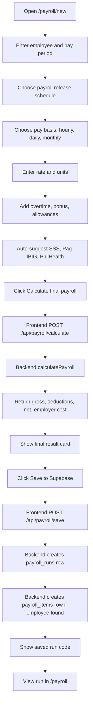

# Payroll Function Walkthrough

This document explains how the payroll function works in the HR & Payroll Management System.

Main files:

```text
frontend/app/payroll/new/page.tsx
backend/src/controllers/payroll.ts
backend/src/routes/payroll.ts
```

---

## 1. User opens the payroll calculator

Open:

```text
http://localhost:3000/payroll/new
```

The page comes from:

```text
frontend/app/payroll/new/page.tsx
```

The page stores payroll inputs using React state.

Examples:

```ts
const [employeeName, setEmployeeName] = useState("Juan Dela Cruz");
const [payPeriod, setPayPeriod] = useState("May 2026");

const [payBasis, setPayBasis] = useState<PayBasis>("hourly");
const [hourlyRate, setHourlyRate] = useState(120);
const [regularHours, setRegularHours] = useState(160);

const [payFrequency, setPayFrequency] = useState<PayFrequency>("semi-monthly");
const [payoutDay, setPayoutDay] = useState("30");
const [firstCutoffDay, setFirstCutoffDay] = useState("15");
const [secondCutoffDay, setSecondCutoffDay] = useState("30");
```

Default example:

```text
Employee: Juan Dela Cruz
Pay basis: Per hour
Rate: ₱120
Hours: 160
Payroll release: Semi-monthly, 15th and 30th
```

---

## 2. Step 1: Employee, pay period, and release schedule

The user enters:

```text
Employee name
Pay period
Payroll release schedule
```

Example:

```text
Employee name: Juan Dela Cruz
Pay period: June 2026
Payroll schedule: Semi-monthly
First payout day: 15th
Second payout day: 30th
```

The release schedule is stored in:

```ts
payFrequency
payoutDay
firstCutoffDay
secondCutoffDay
```

The frontend creates a readable schedule label:

```ts
const payoutSchedule = useMemo(() => {
  if (payFrequency === "monthly") {
    return `Monthly · every ${dayLabel(payoutDay)}`;
  }

  return `Semi-monthly · every ${dayLabel(firstCutoffDay)} and ${dayLabel(secondCutoffDay)}`;
}, [payFrequency, payoutDay, firstCutoffDay, secondCutoffDay]);
```

Example output:

```text
Semi-monthly · every 15th and 30th
```

---

## 3. Step 2: Choose pay basis

The user can choose:

| Pay basis | Formula |
|---|---|
| Per hour | hourly rate × regular hours |
| Per day | daily rate × days worked |
| Monthly | fixed monthly salary |

The type is:

```ts
type PayBasis = "hourly" | "daily" | "monthly";
```

The labels are controlled by:

```ts
const basisConfig = {
  hourly: {
    label: "Per hour",
    rateLabel: "Hourly rate",
    unitLabel: "Regular hours",
    unitSuffix: "hrs",
    formula: "Basic salary = hourly rate × regular hours.",
  },
  daily: {
    label: "Per day",
    rateLabel: "Daily rate",
    unitLabel: "Days worked",
    unitSuffix: "days",
    formula: "Basic salary = daily rate × days worked.",
  },
  monthly: {
    label: "Monthly",
    rateLabel: "Monthly salary",
    unitLabel: "",
    unitSuffix: "",
    formula: "Basic salary = fixed monthly amount.",
  },
};
```

---

## 4. Basic salary calculation

The frontend computes basic salary live.

Formula:

```ts
const basicSalary = payBasis === "monthly"
  ? hourlyRate
  : hourlyRate * regularHours;
```

The variable `hourlyRate` changes meaning depending on the selected basis:

| Basis | `hourlyRate` means |
|---|---|
| Hourly | hourly rate |
| Daily | daily rate |
| Monthly | monthly salary |

### Hourly example

```text
Rate: ₱120
Hours: 160

₱120 × 160 = ₱19,200
```

### Daily example

```text
Daily rate: ₱800
Days worked: 22

₱800 × 22 = ₱17,600
```

### Monthly example

```text
Monthly salary: ₱30,000

Basic salary = ₱30,000
```

---

## 5. Step 3: Additional earnings

The user can add:

```text
Allowances
Bonus
Overtime hours
Overtime rate per hour
```

Overtime pay:

```ts
const overtimePay = overtimeHours * overtimeRate;
```

Gross earnings:

```ts
grossEarnings = basicSalary + overtimePay + bonus + allowances;
```

Example:

```text
Basic salary: ₱19,200
Overtime pay: ₱750
Bonus: ₱1,000
Allowances: ₱2,000

Gross earnings = ₱22,950
```

---

## 6. Step 4: Statutory deductions

The app auto-suggests Philippine statutory deductions:

```text
SSS
Pag-IBIG
PhilHealth
```

The user can edit these manually.

### SSS

Computed with salary brackets:

```ts
computeSssContribution(monthlyCompensation)
```

At higher compensation, the current calculator caps employee SSS at:

```text
₱900
```

### Pag-IBIG

```ts
function computePagIbigContribution(monthlyCompensation: number) {
  const rate = monthlyCompensation <= 1500 ? 0.01 : 0.02;
  return Math.min(monthlyCompensation * rate, 200);
}
```

Meaning:

```text
1% or 2%, capped at ₱200
```

### PhilHealth

```ts
function computePhilHealthContribution(monthlyCompensation: number) {
  const premium = monthlyCompensation * 0.05;
  const monthlyPremium = Math.min(Math.max(premium, 500), 5000);
  return monthlyPremium / 2;
}
```

Meaning:

```text
5% total monthly premium
minimum ₱500
maximum ₱5,000
employee share = half
```

---

## 7. Live PHP preview

The right-side preview shows:

```text
Employee
Pay period
Release schedule
Pay basis
Rate
Hours / days
Basic salary
Overtime pay
Gross earnings
SSS
Pag-IBIG
PhilHealth
Loan / other deductions
Total deductions
Estimated net pay
```

This updates automatically as the user types.

---

## 8. User clicks Calculate final payroll

When the user clicks:

```text
Calculate final payroll
```

The frontend runs:

```ts
handleSubmit()
```

It sends a POST request to:

```text
http://localhost:4000/api/payroll/calculate
```

Payload:

```ts
{
  basicSalary: Number(estimate.basicSalary),
  overtimeHours: Number(overtimeHours),
  overtimeRate: Number(overtimeRate),
  bonus: Number(bonus),
  allowances: Number(allowances),
  taxRate: 0,
  insuranceDeduction: Number(estimate.statutoryDeductions),
  loanDeduction: Number(loanDeduction),
}
```

Important:

```ts
taxRate: 0
```

This means withholding tax is currently disabled.

Also:

```ts
insuranceDeduction = SSS + Pag-IBIG + PhilHealth
```

---

## 9. Backend receives the calculation request

Route file:

```text
backend/src/routes/payroll.ts
```

Route:

```ts
router.post('/calculate', (req, res) => {
  try {
    const result = calculatePayroll(req.body);
    res.json(result);
  } catch (error) {
    res.status(400).json({
      message: 'Invalid payroll payload',
      error: (error as Error).message,
    });
  }
});
```

It calls:

```text
backend/src/controllers/payroll.ts
```

---

## 10. Backend calculates final payroll

Function:

```ts
export function calculatePayroll(components: PayrollComponents): PayrollResult {
  const overtimePay = components.overtimeHours * components.overtimeRate;

  const grossEarnings =
    components.basicSalary +
    overtimePay +
    components.bonus +
    components.allowances;

  const taxAmount = Math.round(grossEarnings * components.taxRate);

  const totalDeductions =
    taxAmount +
    components.insuranceDeduction +
    components.loanDeduction;

  const netPay = Math.max(0, grossEarnings - totalDeductions);

  const employerCost = grossEarnings + components.insuranceDeduction;

  return {
    grossEarnings,
    totalDeductions,
    netPay,
    taxAmount,
    employerCost,
  };
}
```

Backend formulas:

```text
Overtime pay = overtime hours × overtime rate

Gross earnings = basic salary + overtime pay + bonus + allowances

Tax amount = gross earnings × tax rate

Total deductions = tax + statutory deductions + loan deductions

Net pay = gross earnings - total deductions

Employer cost = gross earnings + statutory deductions
```

---

## 11. Backend returns final result

Example response:

```json
{
  "grossEarnings": 22950,
  "totalDeductions": 1673.75,
  "netPay": 21276.25,
  "taxAmount": 0,
  "employerCost": 24623.75
}
```

The frontend stores the result and shows the final output card.

---

## 12. User clicks Save to Supabase

After calculation, this button appears:

```text
Save to Supabase
```

It calls:

```ts
handleSave()
```

It sends a POST request to:

```text
http://localhost:4000/api/payroll/save
```

Payload:

```ts
{
  employeeName,
  payPeriod,
  payBasis,
  payFrequency,
  payoutDay,
  firstCutoffDay,
  secondCutoffDay,
  rate: hourlyRate,
  units: regularHours,
  overtimeHours,
  overtimeRate,
  bonus,
  allowances,
  sssContribution,
  pagIbigContribution,
  philHealthContribution,
  loanDeduction,
  basicSalary: estimate.basicSalary,
  grossEarnings: result.grossEarnings,
  totalDeductions: result.totalDeductions,
  netPay: result.netPay,
  employerCost: result.employerCost,
}
```

This saves:

```text
Payroll money values
Payroll schedule values
Pay basis values
```

---

## 13. Backend saves the payroll run

Save route:

```text
backend/src/routes/payroll.ts
```

Endpoint:

```text
POST /api/payroll/save
```

It performs these steps:

### A. Finds the organization

It finds:

```text
Demo Company
```

Query:

```ts
const { data: orgs } = await supabase
  .from('organizations')
  .select('id')
  .eq('name', 'Demo Company')
  .order('created_at', { ascending: true })
  .limit(1);
```

### B. Generates a run code

Example:

```text
PR-2026-06-1718845123456
```

Code:

```ts
const runCode = `PR-${now.getFullYear()}-${String(now.getMonth() + 1).padStart(2, '0')}-${Date.now()}`;
```

### C. Computes pay period dates

Currently, the backend defaults to the current month:

```text
pay_period_start = first day of current month
pay_period_end = last day of current month
```

Example:

```text
2026-06-01 → 2026-06-30
```

### D. Computes payout date

If monthly:

```text
payout_date = selected payout day
```

Example:

```text
Monthly every 30th → 2026-06-30
```

If semi-monthly:

```text
payout_date = second payout day
```

Example:

```text
Semi-monthly 15th and 30th → 2026-06-30
```

If the selected day is `EOM`, it uses the last day of the month.

---

## 14. Backend inserts into payroll_runs

Supabase table:

```text
payroll_runs
```

Saved columns:

```ts
{
  organization_id,
  run_code,
  pay_period_start,
  pay_period_end,
  payout_date,
  status: "Draft",

  total_gross_pay,
  total_sss,
  total_pagibig,
  total_philhealth,
  total_other_deductions,
  total_deductions,
  total_net_pay,
  total_employer_cost,

  pay_basis,
  pay_frequency,
  payout_day,
  second_payout_day,
  pay_period_label,

  notes
}
```

Example saved row:

```json
{
  "run_code": "PR-2026-06-1718845123456",
  "pay_period_start": "2026-06-01",
  "pay_period_end": "2026-06-30",
  "payout_date": "2026-06-30",
  "status": "Draft",
  "total_gross_pay": 22950,
  "total_sss": 900,
  "total_pagibig": 200,
  "total_philhealth": 573.75,
  "total_other_deductions": 0,
  "total_deductions": 1673.75,
  "total_net_pay": 21276.25,
  "pay_basis": "hourly",
  "pay_frequency": "semi-monthly",
  "payout_day": null,
  "second_payout_day": "30",
  "pay_period_label": "June 2026",
  "notes": "Pay basis: hourly. Release schedule: semi-monthly on days 15 and 30."
}
```

---

## 15. Backend optionally inserts into payroll_items

The backend tries to find the employee by name:

```ts
const { data: employees } = await supabase
  .from('employees')
  .select('id')
  .ilike('full_name', employeeName.trim())
  .limit(1);
```

If found, it inserts into:

```text
payroll_items
```

Saved employee-level details:

```ts
{
  payroll_run_id,
  employee_id,
  hourly_rate,
  regular_hours,
  regular_pay,
  overtime_hours,
  overtime_rate,
  overtime_pay,
  allowances,
  bonus,
  gross_pay,
  sss_deduction,
  pagibig_deduction,
  philhealth_deduction,
  other_deductions,
  total_deductions,
  net_pay,
  employer_cost
}
```

Important interpretation:

| Pay basis | `hourly_rate` stores | `regular_hours` stores |
|---|---|---|
| Hourly | hourly rate | regular hours |
| Daily | daily rate | days worked |
| Monthly | monthly salary | 0 |

The actual selected basis is stored in:

```text
payroll_runs.pay_basis
```

---

## 16. Frontend shows save success

After saving, the frontend shows:

```text
✓ Saved as PR-2026-06-1718845123456
```

The button changes to:

```text
Saved to Supabase
```

---

## 17. User views saved payroll run

Open:

```text
http://localhost:3000/payroll
```

The page fetches:

```text
GET http://localhost:4000/api/data/payroll-runs
```

From Supabase table:

```text
payroll_runs
```

It displays:

```text
Run code
Period
Payout date
Gross pay
Status
```

The new saved run appears with status:

```text
Draft
```

---

## Full payroll flow diagram



---

## Simple example walkthrough

Assume:

```text
Employee: Juan Dela Cruz
Pay period: June 2026
Pay frequency: Semi-monthly
Payout days: 15th and 30th
Pay basis: Per hour
Hourly rate: ₱120
Regular hours: 160
Overtime hours: 5
Overtime rate: ₱150
Bonus: ₱1,000
Allowances: ₱2,000
Loan deduction: ₱0
```

### Step A: Basic salary

```text
₱120 × 160 = ₱19,200
```

### Step B: Overtime pay

```text
5 × ₱150 = ₱750
```

### Step C: Gross earnings

```text
₱19,200 + ₱750 + ₱1,000 + ₱2,000 = ₱22,950
```

### Step D: Statutory deductions

Approximate values:

```text
SSS: ₱900
Pag-IBIG: ₱200
PhilHealth: ₱573.75
```

Total statutory deductions:

```text
₱1,673.75
```

### Step E: Net pay

```text
₱22,950 - ₱1,673.75 = ₱21,276.25
```

### Step F: Save to Supabase

Saved to `payroll_runs`:

```text
run_code: PR-2026-06-...
status: Draft
pay_basis: hourly
pay_frequency: semi-monthly
second_payout_day: 30
payout_date: 2026-06-30
total_gross_pay: 22950
total_net_pay: 21276.25
```

If the employee exists, it also saves one row to `payroll_items`.

---

## Required migration

Before saving works, this migration must be run in Supabase SQL Editor:

```sql
alter table payroll_runs add column if not exists pay_basis text;
alter table payroll_runs add column if not exists pay_frequency text;
alter table payroll_runs add column if not exists payout_day text;
alter table payroll_runs add column if not exists second_payout_day text;
alter table payroll_runs add column if not exists pay_period_label text;
```

Without this migration, calculation still works, but saving will fail because Supabase does not have the new columns yet.
